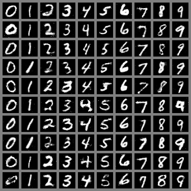

# 第二届Jittor挑战赛热身赛

## 方法和结果
本项目使用的算法基于论文[Conditional Generative Adversarial Nets](https://arxiv.org/abs/1411.1784)实现。结果如下:



## 简介
本项目包含了第二届计图挑战赛-热身赛的实现源码。我们利用经典的Conditional GAN方法来生成手写数字。该方法生成的手写数字在比赛组织方提供的评测程序中正确率为0.9135，评测通过。

## 安装

### 运行环境
Red Hat 4.8.5-44
python==3.8
jittor==1.3.4.7

### 安装依赖

* **使用者可通过下述命令安装相关依赖项**
```shell
pip install imageio imageio-ffmpeg opencv-python numpy tqdm pyyaml pillow 
```

* **安装jittor**
    1. 准备事项：安装cuda
    ```shell
    python -m jittor_utils.install_cuda
    ```
    2. 准备事项：安装openmpi

    jittor利用openmpi来完成多卡计算，为了验证机器上是否安装了openmpi，可以在终端输入如下命令：
    ```shell
    mpirun
    ```
    如果找不到这条命令，说明机器里没有安装openmpi，需要手动安装。有sudo权限的用户可以跟随[jittor tutorial](https://cg.cs.tsinghua.edu.cn/jittor/assets/docs/jittor.mpi.html)提供的教程安装。如果没有sudo权限，则需要从源码编译安装。从[这里](https://www.open-mpi.org/software/ompi/v4.1/)下载与系统对应的openmpi源码，下载解压后进入代码目录，然后通过如下两条指令编译安装：
    ```shell
    ./configure --prefix /any/path/you/want
    make & make install
    ```
    其中，`/any/path/you/want`可以是用户指定的任意路径，前提是用户要有此路径的写权限。上述命令执行完成后，openmpi相关的链接库和可执行文件会被安装到用户指定的安装目录下。然后打开`~/.bashrc`文件，添加如下两行代码：
    ```shell
    export PATH=/openmpi/install/path/bin:$PATH
    export LD_LIBRARY_PATH=/openmpi/install/path/lib:$LD_LIBRARY_PATH
    ```
    其中，`/openmpi/install/path`使用户在上一步指定的openmpi安装目录。修改完成后在终端输入：
    ```shell
    source ~/.bashrc
    ```
    使安装生效。然后再在终端输入命令：
    ```shell
    which mpirun
    ```
    如果能成功输出命令路径说明安装成功。

    3. 安装jittor
    准备事项完成后，可以利用pip直接安装jittor
    ```shell
    pip install jittor
    ```

## 训练

模型训练命令如下：
```shell
python CGAN.py
```

## 推理

我们的预训练模型已在`models`目录下提供，可以将`models`目录下的两个`pkl`文件直接复制到源码根目录，然后直接运行源码文件：
```shell
cp models/*.pkl ./
python CGAN.py
```
生成的结果将被写入`result.png`文件，用户可以查看。

## 致谢
本项目使用的算法基于论文[Conditional Generative Adversarial Nets](https://arxiv.org/abs/1411.1784)实现。项目源码基于Jittor官方开源的[JGAN项目](https://github.com/Jittor/JGAN)修改和书写，特此感谢！
